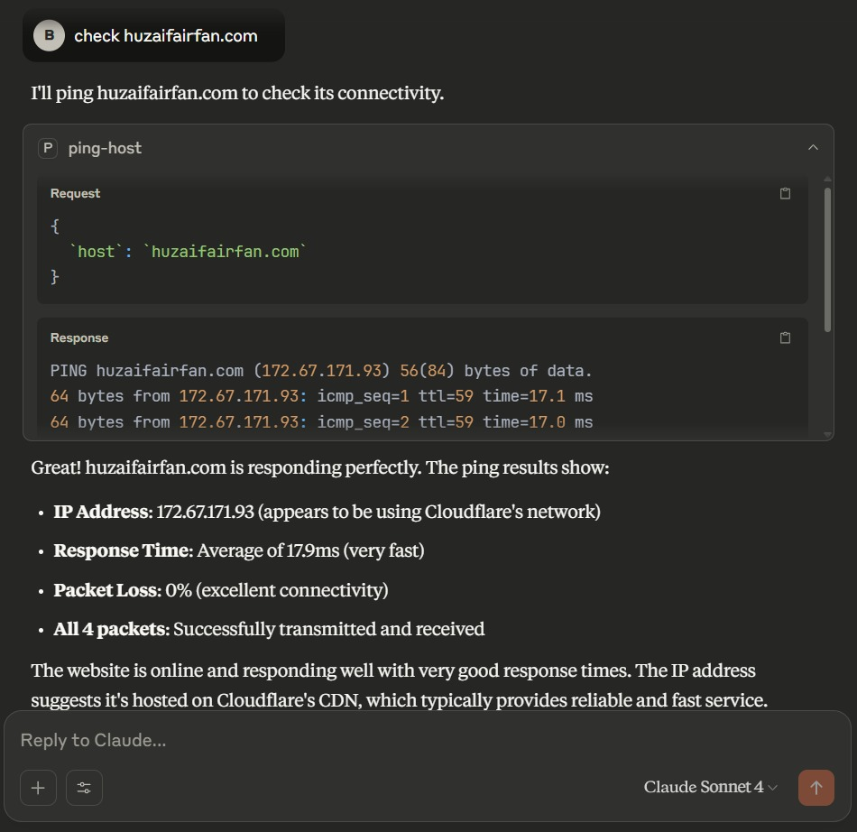

<br />

<div align="center">
  <h1>ping mcp server</h1>
  <p><h3 align="center">MCP Server to Ping Other hosts 🚀</h3></p>
</div>

[Upwork Job]()
&nbsp;&nbsp;•&nbsp;&nbsp;


## Run Ping MCP Server SSE

```sh
FASTMCP_HOST="0.0.0.0" FASTMCP_PORT=1234 uv run ping-mcp-server
```

## Test

```sh
uv run pytest
```

### MCP Inspector

```sh
npx -y @modelcontextprotocol/inspector
```

## Claude Configuration

```json
{
    "mcpServers": {
        "ping": {
            "command": "npx",
            "args": [
                "mcp-remote",
                "http://localhost:1234/sse",
                "--allow-http"
            ]
        }
    }
}
```




## 🤝🏻 &nbsp;Connect with Me

<p align="center">
<a href="https://www.huzaifairfan.com"></a>
<a href="https://www.linkedin.com/in/huzaifairfan/"></a>
<a href="https://github.com/HuzaifaIrfan/"></a>
<a href="mailto:contact@huzaifairfan.com"></a>
</p>

## License

Licensed under the MIT License, Copyright 2025 Huzaifa Irfan. [LICENSE](LICENSE)